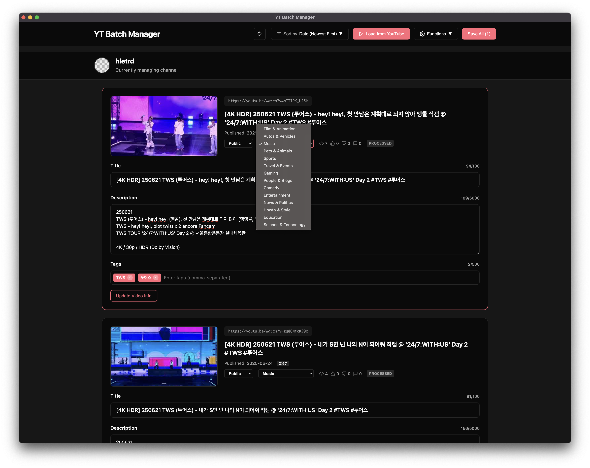
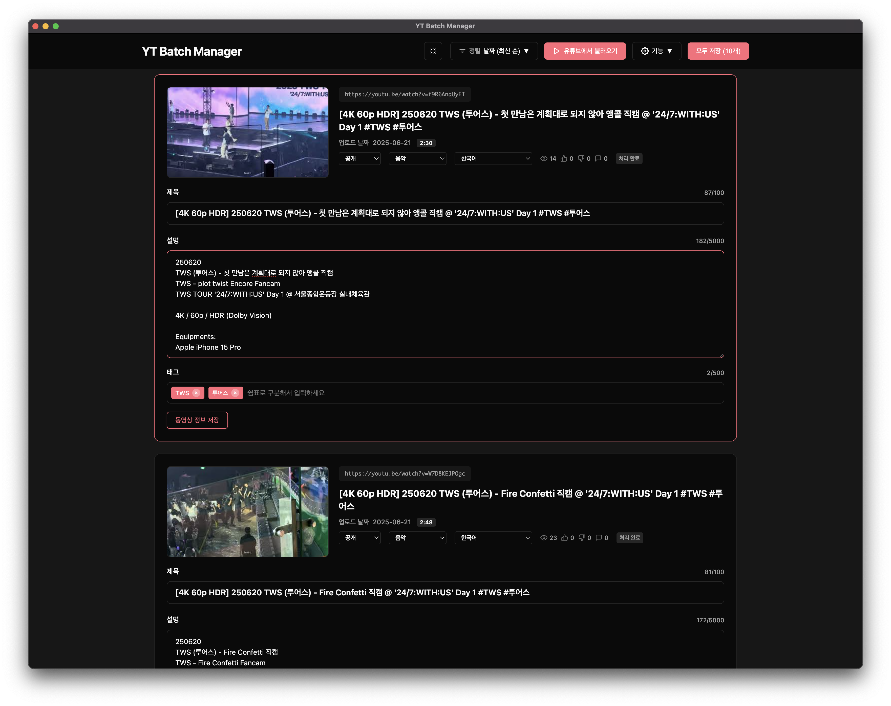

# YT Batch Manager





## [Download](https://github.com/hletrd/yt-batch-manager/releases)

* Download the older versions from [Releases](https://github.com/hletrd/yt-batch-manager/releases).
* 구 버전은 [Releases](https://github.com/hletrd/yt-batch-manager/releases) 페이지에서 다운로드할 수 있습니다.

### macOS

* [macOS (Intel)](https://github.com/hletrd/yt-batch-manager/releases/latest/download/YT.Batch.Manager-1.0.7-x64.dmg)
* [macOS (Apple Silicon)](https://github.com/hletrd/yt-batch-manager/releases/latest/download/YT.Batch.Manager-1.0.7-arm64.dmg)
* [macOS (Universal, Intel + Apple Silicon)](https://github.com/hletrd/yt-batch-manager/releases/latest/download/YT.Batch.Manager-1.0.7-universal.dmg)

### Windows

* [Windows (x86-64)](https://github.com/hletrd/yt-batch-manager/releases/latest/download/YT.Batch.Manager-1.0.7-x64.exe)
* [Windows (arm64)](https://github.com/hletrd/yt-batch-manager/releases/latest/download/YT.Batch.Manager-1.0.7-arm64.exe)

### Linux

* [Linux (x86-64)](https://github.com/hletrd/yt-batch-manager/releases/latest/download/YT.Batch.Manager-1.0.7-x86_64.AppImage)
* [Linux (arm64)](https://github.com/hletrd/yt-batch-manager/releases/latest/download/YT.Batch.Manager-1.0.7-arm64.AppImage)

## About

As both YouTube studio webpage and YT studio mobile app does not provide a convinient user experiences for batch editing video titles and descriptions, I had to make this app to manage titles and descriptions of my videos in a single place.

This is an Electron port, as a standalone app, of [yt-batch-manager-py](https://github.com/hletrd/yt-batch-manager-py). It supports macOS (Intel, Apple Silicon) 10.15+, Windows (x86-64, arm64) 10+, and many Linux distributions (x86-64, arm64, tested on Ubuntu 24.04 LTS).

* Disclaimer: YouTube is a registered trademark of Google LLC, and this project is not affiliated with YouTube in any way.

## 설명

유튜브 채널의 영상 제목과 설명을 한 페이지에서 바로 수정하고 관리할 수 있는 앱입니다.

유튜브 채널에서 영상 제목과 설명을 한 번에 수정할 때 각 영상에 하나하나 들어가서 확인하고 수정해야 하는 게 너무 킹받아서 만들었습니다. 웹 페이지든 YT Studio 모바일 앱이든 왜 영상 제목과 설명을 한 번에 나열해서 수정할 수 있는 기능이 없는건지 모르겠습니다. 원래 [Python으로 만들었다가](https://github.com/hletrd/yt-batch-manager-py) 별도 데스크탑 앱이 편할 것 같아 Electron으로 다시 만들었습니다. macOS(Intel, Apple Silicon) 10.15 이상과 윈도우(x86-64, arm64) 10 이상, 여러 리눅스 배포판(x86-64, arm64, 우분투 24.04에서 테스트함)을 지원합니다.

---

## Features

* Edit video titles and descriptions in a single page, which YouTube does not allow.
  * YouTube forces a very user-unfriendly experiences, where you have to go to each video page to edit the title and description, and then save it.
* Save/load video data to/from local JSON files.

## 기능 (한국어)

* 유튜브 채널의 영상 하나하나를 각각 열지 않아도 한 번에 영상 제목과 설명을 편집할 수 있습니다.
  * 이거 유튜브 Studio 웹페이지나 YT Studio 앱에서는 안 됩니다. 대체 왜 안 되는지 모르겠습니다.
* 영상 제목과 설명을 JSON으로 저장하고 불러올 수 있습니다.
* 영상 공개 설정 / 카테고리 / 언어 / 태그 등도 한 번에 편집할 수 있습니다.

## Using the app

* Download the prebuilt app from [Releases](https://github.com/hletrd/yt-batch-manager/releases).
* Follow the [Google API setup](#google-api-setup) section to get the credentials JSON file.
* Run the app and select the credentials JSON file.
* Complete Google OAuth authentication in your browser.
* Click "Load from YouTube" to fetch your videos.
* Edit the titles and descriptions of the videos.
* Click "Update Video" to update the videos.
* Click "Save to File" to save the video data to a local JSON file.
* Click "Load from File" to restore the video data from a local JSON file.

## 사용방법 (한국어)

* [Releases](https://github.com/hletrd/yt-batch-manager/releases) 페이지에서 앱을 다운로드합니다. macOS (x86_64 / arm64), Windows (x86_64, arm64)를 지원합니다.
* [Google Cloud Console](https://console.cloud.google.com/)에서 새 프로젝트 아무 이름으로 생성합니다. 상단 검색창에 **YouTube Data API v3**를 검색하여 페이지에 들어가고 '사용' 버튼을 클릭해 활성화합니다.
* 상단 검색창에 **OAuth 동의 화면**을 검색하여 페이지에 들어갑니다. 이후 '시작하기'를 클릭합니다. 앱 이름은 자유롭게 설정해도 됩니다. 사용자 지원 이메일은 본인의 이메일을 입력합니다. 대상은 '외부'로 설정합니다. 연락처 정보에 본인의 이메일을 입력합니다. 이후 사용자 데이터 정책에 동의하고, '만들기' 버튼을 클릭합니다.
* 좌측 메뉴에서 '클라이언트'를 선택합니다. '클라이언트 만들기'를 클릭하고, 애플리케이션 유형을 '데스크톱 앱'으로 설정합니다. 클라이언트를 생성하고 'JSON 다운로드'를 클릭해 키 파일을 다운로드합니다. JSON은 페이지를 닫으면 다시 다운로드할 수 없으니 주의합니다.
* 같은 페이지의 좌측 메뉴에서 '데이터 액세스'를 선택하고, '범위 추가 또는 삭제'를 클릭합니다. '직접 범위 추가'에 다음 내용을 입력하고 '테이블에 추가'를 클릭한 뒤 업데이트합니다.
```
https://www.googleapis.com/auth/youtube
https://www.googleapis.com/auth/youtube.force-ssl
```
* 좌측 메뉴에서 '대상'을 클릭하고, '테스트 사용자' 항목에 본인의 Gmail 계정을 추가합니다.
* 다운로드한 앱을 실행합니다.
* 'credentials.json 파일 선택' 버튼을 클릭하고 앞서 다운로드한 파일을 선택합니다.

---

## Guide for developers

### Prerequisites

* Node.js 22.0.0+ installed.
* Google Cloud Console project with YouTube Data API v3 enabled.
* Your own YouTube channel.

### Setup

#### Install dependencies

```bash
$ npm install
```

#### Google API setup

##### Create a new project
1. Go to [Google Cloud Console](https://console.cloud.google.com/)
2. Create a new project, name it whatever you want.
3. Search for the **YouTube Data API v3** in the search bar, and enable it.
4. Search for the **OAuth consent screen** in the search bar, and navigate into it.
5. Click 'Get started'. Fill in the app name as whatever you want and user support email as your email address. Set audience to 'External'. Input your email addreess in 'Contact information'. Agree to the usage policy, and tap 'Create'.
6. click 'Clients' on the left sidebar.
7. Create a new client app as a desktop app, name it whatever you want.
8. Download the credentials JSON file.

##### Add scopes
1. Search for the **OAuth consent screen** in the search bar, and click 'Data Access' on the left sidebar.
2. Click 'Add or remove scopes' and enter following scopes in **Manually add scopes** text box:
```
https://www.googleapis.com/auth/youtube
https://www.googleapis.com/auth/youtube.force-ssl
```
3. Click 'Add to table'.
4. Click 'Update'.
5. Click 'Save'.

##### Add yourself as a test user
1. Search for the **OAuth consent screen** in the search bar, and click 'Audience' on the left sidebar.
2. Click 'Add user' under 'Test users' and enter your email address.

#### Run the application (for development)

```bash
npm run dev
```

The application will launch and prompt for Google OAuth authentication on first run.

---

## Troubleshooting

### Google OAuth authentication fails
1. Remove the stored credentials by clicking the "Remove Saved Credentials" button and reload the file.
2. If the problem persists, try to re-create the `credentials.json` file.
